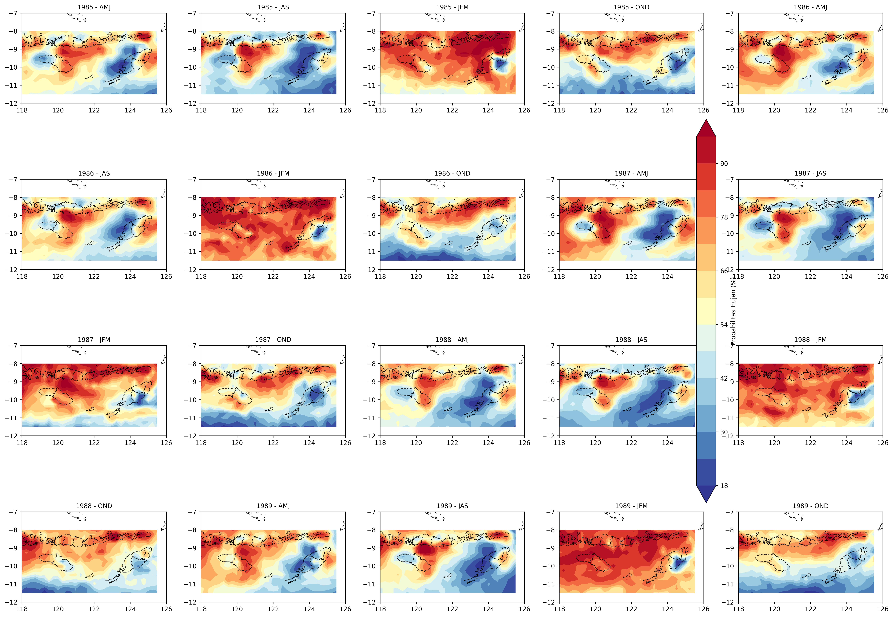
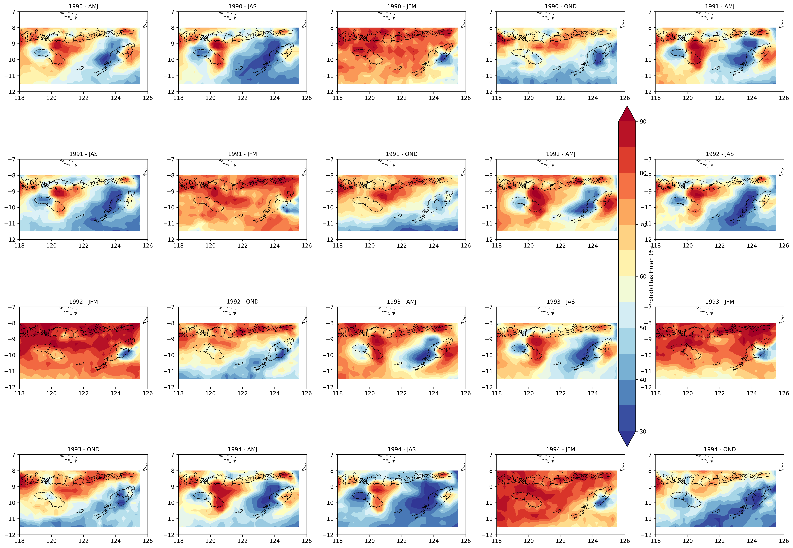
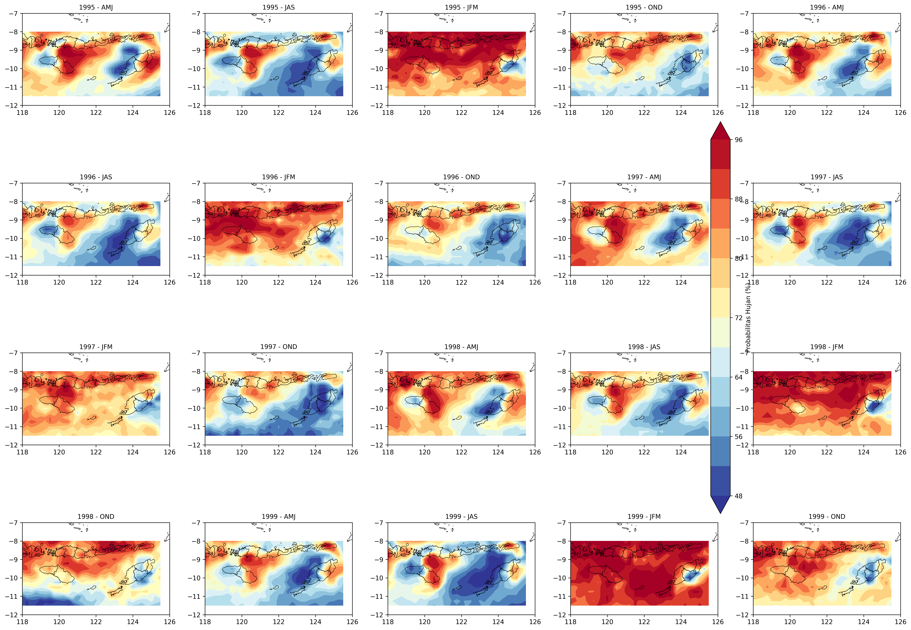

# 🌧️ Analisis Probabilitas Hujan Berbasis Spasial — NTT

<div align="center">


**Proyek Meteorologi & Klimatologi | Analisis Probabilitas Hujan Wilayah NTT**

[📖 Tentang Proyek](#-tentang-proyek) •
[✨ Fitur](#-fitur) •
[📁 Struktur Proyek](#-struktur-proyek) •
[🚀 Cara Menjalankan](#-cara-menjalankan) •
[📊 Visualisasi](#-visualisasi) •
[📦 Teknologi](#-teknologi-yang-digunakan) •
[👤 Author](#-author)

</div>

---

## 📖 Tentang Proyek

Proyek ini merupakan bagian dari mata kuliah **Meteorologi & Klimatologi (Metklim)** yang bertujuan untuk menganalisis dan memvisualisasikan **probabilitas kejadian hujan secara spasial** di wilayah **Nusa Tenggara Timur (NTT)**, Indonesia.

Analisis dilakukan berdasarkan data curah hujan historis dari berbagai sumber klimatologi, termasuk data **Oceanic Niño Index (ONI)** untuk memperhitungkan pengaruh fenomena **El Niño / La Niña**, serta data gridded curah hujan berformat **NetCDF (`.nc`)** dari model reanalisis global (ERA5/ECMWF).

> 🎯 **Tujuan Utama:** Memahami pola distribusi spasial probabilitas hujan di NTT berdasarkan musim dan tahun, serta menyajikannya dalam bentuk dashboard interaktif yang mudah dipahami.

---

## ✨ Fitur

- 📡 **Pengolahan Data NetCDF** — Membaca dan memproses data curah hujan dari file `.nc` (ERA5/ECMWF)
- 🗺️ **Visualisasi Peta Spasial** — Peta sebaran probabilitas hujan berbasis kontur + overlay shapefile Indonesia
- 📅 **Filter Temporal** — Analisis per tahun (2021–2023) dan per musim (DJF, MAM, JJA, SON)
- 📈 **Analisis Statistik** — Perhitungan probabilitas hujan menggunakan pendekatan klimatologi
- 🌊 **Integrasi Data ONI** — Mempertimbangkan pengaruh ENSO (El Niño–Southern Oscillation) terhadap curah hujan
- 🖥️ **Dashboard Interaktif** — Antarmuka web berbasis Streamlit dengan filter sidebar dinamis
- 📊 **Tabel Data** — Tampilan data tabular untuk validasi dan eksplorasi lebih lanjut

---

## 📁 Struktur Proyek

```
ProjekMetklim-ProbabilitasHujan/
│
├── 📓 main.ipynb                          # Notebook utama: analisis & preprocessing data
├── 🐍 app.py                              # Aplikasi dashboard Streamlit
├── 📄 app.text                            # Catatan / draf kode tambahan
│
├── 📊 Data
│   ├── ONI.csv                            # Data Oceanic Niño Index (ENSO)
│   └── data_stream-oper_stepType-accum.nc # Data curah hujan gridded (NetCDF/ERA5)
│
├── 🗺️ Shapefile Indonesia
│   ├── indonesia_kab.shp                  # Shapefile batas kabupaten Indonesia
│   ├── indonesia_kab.shx                  # Index shapefile
│   ├── indonesia_kab.dbf                  # Database atribut
│   ├── indonesia_kab.prj                  # Proyeksi koordinat
│   ├── indonesia_kab.cpg                  # Encoding karakter
│   └── indonesia_kab.shp.xml             # Metadata shapefile
│
├── 🖼️ Hasil Visualisasi
│   ├── Frame_1.png
│   ├── Frame_2.png
│   ├── Frame_3.png
│   ├── Frame_4.png
│   ├── Frame_5.png
│   ├── Frame_6.png
│   └── Frame_7.png
│
└── 📋 .gitignore
```

---

## 🚀 Cara Menjalankan

### 1. Prasyarat

Pastikan kamu sudah menginstal **Python 3.9+** dan **pip**.

### 2. Clone Repository

```bash
git clone https://github.com/yusufal-qodri/ProjekMetklim-ProbabilitasHujan.git
cd ProjekMetklim-ProbabilitasHujan
```

### 3. Install Dependencies

Instal semua library yang dibutuhkan:

```bash
pip install streamlit pandas numpy matplotlib geopandas shapely netCDF4 xarray scipy
```

Atau buat file `requirements.txt` dan jalankan:

```bash
pip install -r requirements.txt
```

<details>
<summary>📋 Daftar lengkap library yang digunakan</summary>

```
streamlit>=1.24.0
pandas>=1.5.0
numpy>=1.23.0
matplotlib>=3.6.0
geopandas>=0.12.0
shapely>=2.0.0
netCDF4>=1.6.0
xarray>=2023.1.0
scipy>=1.10.0
```

</details>

### 4. Jalankan Notebook (Analisis Data)

Buka dan jalankan notebook utama untuk preprocessing dan analisis:

```bash
jupyter notebook main.ipynb
```

### 5. Jalankan Dashboard Streamlit

Sebelum menjalankan, sesuaikan path shapefile di `app.py`:

```python
# app.py — baris path shapefile (sesuaikan dengan lokasi file kamu)
path_shp = "indonesia_kab.shp"   # atau path absolut jika perlu
```

Kemudian jalankan:

```bash
streamlit run app.py
```

Dashboard akan terbuka otomatis di browser pada `http://localhost:8501`

---

## 📊 Visualisasi

### 🗺️ Peta Sebaran Probabilitas Hujan

Dashboard menampilkan peta kontur probabilitas hujan secara spasial di wilayah NTT (Bujur: 118°–126° BT, Lintang: -12° – -7° LS), dengan overlay batas wilayah kabupaten Indonesia.

| Musim | Keterangan |
|-------|------------|
| **DJF** | Desember–Januari–Februari (Musim Hujan) |
| **MAM** | Maret–April–Mei (Transisi) |
| **JJA** | Juni–Juli–Agustus (Musim Kering) |
| **SON** | September–Oktober–November (Transisi) |

### 🌊 Indeks ONI & ENSO

Data ONI (Oceanic Niño Index) digunakan untuk mengklasifikasikan kondisi ENSO:

| Nilai ONI | Kondisi |
|-----------|---------|
| ≥ +0.5    | El Niño (curah hujan cenderung berkurang) |
| -0.5 s/d +0.5 | Normal |
| ≤ -0.5   | La Niña (curah hujan cenderung meningkat) |

### 📸 Contoh Output Visualisasi

Berikut beberapa frame hasil analisis yang tersimpan di repository:

| Frame 1 | Frame 2 | Frame 3 |
|---------|---------|---------|
|  |  |  |

---

## 📦 Teknologi yang Digunakan

| Library | Fungsi |
|---------|--------|
| `Streamlit` | Framework dashboard web interaktif |
| `Pandas` | Manipulasi dan analisis data tabular |
| `NumPy` | Komputasi numerik dan array |
| `Matplotlib` | Visualisasi grafik dan peta kontur |
| `GeoPandas` | Pemrosesan data geospasial & shapefile |
| `Shapely` | Geometri spasial dan operasi vektor |
| `NetCDF4 / xarray` | Pembacaan data curah hujan format `.nc` |

---

## 🧪 Alur Analisis

```
Data NetCDF (ERA5)          Data ONI (CSV)
       │                          │
       ▼                          ▼
  Preprocessing              Klasifikasi
  (xarray/netCDF4)           ENSO Phase
       │                          │
       └──────────┬───────────────┘
                  ▼
         Perhitungan Probabilitas Hujan
         (per grid, per musim, per tahun)
                  │
                  ▼
         Visualisasi Spasial
         (Matplotlib + GeoPandas)
                  │
                  ▼
         Dashboard Interaktif
         (Streamlit + Filter Sidebar)
```

---

## 📝 Catatan Penggunaan

> ⚠️ **Perhatian:** Sebelum menjalankan `app.py`, pastikan path file shapefile (`indonesia_kab.shp`) dan file data NetCDF sudah disesuaikan dengan direktori lokal kamu. Path default yang ada di kode mungkin berbeda dengan environment kamu.

```python
# Di app.py, sesuaikan path ini:
path_shp = "indonesia_kab.shp"  # relatif terhadap direktori project

# Di main.ipynb, sesuaikan path data:
# nc_file = "data_stream-oper_stepType-accum.nc"
```

---

## 🌏 Konteks Wilayah Studi

Wilayah kajian mencakup **Nusa Tenggara Timur (NTT)** yang berada di koordinat:
- Bujur Timur: **118° – 126° BT**
- Lintang Selatan: **-12° – -7° LS**

NTT dipilih karena merupakan salah satu wilayah di Indonesia yang **paling rentan terhadap variabilitas iklim**, khususnya pengaruh fenomena ENSO yang secara signifikan memengaruhi pola curah hujan dan berpotensi menimbulkan kekeringan ekstrem pada fase El Niño.

---

## 👤 Author

<div align="center">

**Yusuf Al-Qodri Tsania Susma**

[](https://github.com/yusufal-qodri)

*Mahasiswa Meteorologi & Klimatologi*

</div>

---

## 📄 Lisensi

Proyek ini dibuat untuk keperluan akademik. Bebas digunakan untuk referensi dan pembelajaran dengan mencantumkan sumber.

---

<div align="center">

⭐ **Jika proyek ini membantu, jangan lupa beri bintang!** ⭐

Made with ❤️ for Meteorologi & Klimatologi

</div>
